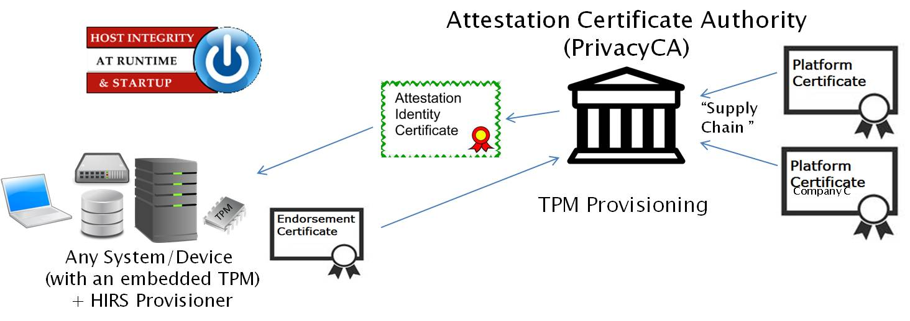

<h1>
Host Integrity at Runtime and Start-up (HIRS) <BR\>
</h1>

<h2>Attestation Certificate Authority (ACA) and TPM Provisioning with Trusted Computing-based Supply Chain Validation </h2>

The Host Integrity at Runtime and Start-up Attestation Certificate Authority is a Proof of Concept - Prototype intended to spur interest and adoption of the [Trusted Platform Module (TPM)](https://trustedcomputinggroup.org/work-groups/trusted-platform-module/). The ACA can be configured to enforce the Validation of Endorsement and Platform Credentials to illustrate a **Supply Chain Validation** capability. It's intended for testing and development purposes only and is not intended for production. The ACA's functionality supports the provisioning of the [TPM 2.0](https://trustedcomputinggroup.org/wp-content/uploads/2019_TCG_TPM2_BriefOverview_DR02web.pdf) with an [Attestation Identity Credential (AIC)](https://www.trustedcomputinggroup.org/wp-content/uploads/IWG-Credential_Profiles_V1_R1_14.pdf). 

The ACA provides a “provisioner” application to be installed on all devices which will be requesting Attestation Credentials.
The ACA is a web based server which processes Attestation Identity Requests.

Version 1.1 added support for the [Platform Certificate v1.1 Specification](https://trustedcomputinggroup.org/resource/tcg-platform-certificate-profile/). This allows entities that are part of the supply chain (System integrators and Value Added Resellers) the ability to create Delta Platform Certificate to compliment the Base Platform Certificate created by the Platform Manufacturer. See the [Article on Base and Delta Platform Certificates](https://github.com/nsacyber/HIRS/wiki/Base-and-Delta-Platform-Certificates) for details.

Version 2.0 added support for the [PC Client Reference Integrity Manifest (RIM) Specification](https://trustedcomputinggroup.org/resource/tcg-pc-client-reference-integrity-manifest-specification/) to provide firmware validation capability to the HIRS ACA. This requires that the manufacturer of a device provide a digitally signed RIM "Bundle" for each device. The HIRS ACA has a new page for uploading and viewing RIM Bundles and a policy setting for requiring Firmware validation.

Version 2.2 introduces the HIRS_Provisioner.NET. The HIRS_Provisioner.NET is a C# implementation of the HIRS Provisioner designed to be a replacement for the HIRS_ProvisionerTPM2. The HIRS_Provisioner.NET can be packaged for Windows as well as most Linux distributions. This portability will support a wider set of scenarios and products. See the [HIRS_Provisioner.NET README](https://github.com/nsacyber/HIRS/blob/master/HIRS_AttestationCAPortal/src/main/webapp/docs/HIRS%20.NET%20Provisioner%20Readme_2.2.pdf) for details.

An ACA Docker image is now automatically created for each release. See the [packages page](https://github.com/orgs/nsacyber/packages?repo_name=HIRS) for published ACA docker images.

To support the TCG RIM concept a new [tools folder](https://github.com/nsacyber/HIRS/tree/master/tools) has been added to the HIRS project which contains a [tcg_rim_tool command line application](https://github.com/nsacyber/HIRS/tree/master/tools/tcg_rim_tool). The tcg_rim_tool can be used to create NISTIR 8060 compatible SWID tags that adhere to the TCG PC Client RIM specification. It also supports the ability to digitally sign the Base RIM file as the HIRS ACA will require a valid signature in order to upload any RIM file. See the [tgc_rim_tool READ.md](https://github.com/nsacyber/HIRS/blob/master/tools/tcg_rim_tool/README.md) for more details.

**Notice:** Github Dicussions have been enabled for this repo. Please refer to the Dicussion entitled "[HIRS development changes](https://github.com/nsacyber/HIRS/discussions/498)" for development and support notifications.
 
## Features

* TPM Provisioner
  * Requests an Attestation Identity Credential for the TPM from the ACA.
  * Takes ownership of TPM if not owned
  * Uses REST calls to complete the transaction with the ACA
  * Reads credentials from the TPM's NvRAM as part of the provisioning process.
  * Reads the device's hardware, network, firmware, and OS info for platform validation
* Attestation Certificate Authority
  * Issues Attestation Identity Credentials to validated devices holding a TPM
  * Configures policies for enabling/disabling validation procedures
  * Performs TCG-based Supply Chain Validation of connecting clients
      * Optionally validates Endorsement and Platform Credentials
* Endorsement Credential Certificate Chain Validation
  * Process EK Credentials per [TCG EK Credential Profile For TPM Family 2.0](https://trustedcomputinggroup.org/resource/tcg-ek-credential-profile-for-tpm-family-2-0/)
  * Verifies the endorsement key used by the TPM was placed there by the original equipment manufacturer (OEM)
* Platform Credential Certificate Chain Validation
  * Process Platform Credentials per [TCG Platform Attribute Credential Profile Specification Version 1.1 Revision 15](https://trustedcomputinggroup.org/wp-content/uploads/IWG_Platform_Certificate_Profile_v1p1_r15_pubrev.pdf)
  * Verifies the provenance of the system's hardware components, such as the motherboard and chassis, by comparing measured component information against the manufacturers, models, and serial numbers listed in the Platform Credential
* Attestation CA Dashboard
  * Displays all Validation Reports, Credentials, and Trust Chains
  * Enables ACA policy configuration for validation of Endorsement and Platform Credentials
  * Enables Import/Export of Certificate (Trust) Chains, Endorsement Credentials, and Platform Credentials
  * Optionally allows uploaded credentials to be used in validation for machines that have been reprovisioned by trusted parties since leaving the OEM
* Firmware Integrity Validation
  * Checks that firmware and boot related file hashes match those provided by OEMs.
  * Validates the import of All RIM files imported to the ACA (insure all RIM files were signed by trusted sources)
  * Verifies that the firmware hashes captured by the TPMs Platform Configuration Registers (PCRs) match the firmware hashes obtained from the OEM(s).
  * Verifies TCG/UEFI boot variables (e.g. BIOS setup data) have not been altered (e.g secure boot).
## Requirements

The HIRS Attestation Certificate Authority (ACA) currently supports installation on CentOS 7 instances only. To simlify installation a ACA Docker image is now automatically created for each [release]https://github.com/orgs/nsacyber/packages?repo_name=HIRS).  Please refer to the Dicussion entitled "[HIRS development changes](https://github.com/nsacyber/HIRS/discussions/498)" for work on OS migration and OS support.

The HIRS Provisioner supports 2.0. on Windows (10 and 11), Linux Centos 7,  RHEL 7+ and derivatives (e.g. Rocky7+) as well as Ubuntu(18+). 

## Installation Instructions

For detailed instructions, see [Installation notes](https://github.com/nsacyber/HIRS/wiki/installation_notes).

Packages used for installation (e.g. HIRS_Provisioner*el7.noarch.rpm) can be found on the [release page](https://github.com/nsacyber/HIRS/releases). 
 
### Installing the ACA

Simply run the command `yum install HIRS_AttestationCA*el7.noarch.rpm` when using an rpm package on Centos 7.

### Installing the Provisioner

After enabling your TPM in BIOS/UEFI:

Select the [package to install](https://github.com/nsacyber/HIRS/releases) on you OS (windows, rpm, or deb)
Follow the instruction from the [HIRS_Provisioner.NET README](https://github.com/nsacyber/HIRS/blob/master/HIRS_AttestationCAPortal/src/main/webapp/docs/HIRS%20.NET%20Provisioner%20Readme_2.2.pdf) 

## Usage

To kick off a provision on the client, run the command `sudo tpm_aca_provision`.

To see the results and interact with the ACA, go to the ACA Portal at `https://ACAPortalAddress:ACAPortalPort/HIRS_AttestationCAPortal/portal/index`.

## Quick Links:

* [TPM 2.0: A brief introduction](https://trustedcomputinggroup.org/wp-content/uploads/2019_TCG_TPM2_BriefOverview_DR02web.pdf)
* [Getting started with The ACA and Platform Credentials](https://github.com/nsacyber/HIRS/wiki/Gettingstarted)
* [HIRS ACA and TPM provisioner Users Guide](https://github.com/nsacyber/HIRS/blob/master/HIRS_AttestationCAPortal/src/main/webapp/docs/HIRS_ACA_UsersGuide_2.1.pdf)
* [HIRS .NET Provisioner Readme](https://github.com/nsacyber/HIRS/blob/master/HIRS_AttestationCAPortal/src/main/webapp/docs/HIRS%20.NET%20Provisioner%20Readme_2.2.pdf)
* [TCG RIM Tool Users Guide](https://github.com/nsacyber/HIRS/blob/master/HIRS_AttestationCAPortal/src/main/webapp/docs/TCG%20Rim%20Tool%20User%20Guide%202.1.pdf)
* [TCG Event Log Tool Users Guide](https://github.com/nsacyber/HIRS/blob/master/HIRS_AttestationCAPortal/src/main/webapp/docs/TCG%20Event%20Log%20Tool%20User%20Guide%202.1.pdf)
* [Installation notes](https://github.com/nsacyber/HIRS/wiki/installation_notes)
* [Project build instructions](https://github.com/nsacyber/HIRS/wiki/Hirs-build-guide)
* [HIRS Attestation Certificate Authority FAQ](https://github.com/nsacyber/HIRS/wiki/FAQ)
* [TPM Provisioner Debug](https://github.com/nsacyber/HIRS/wiki/provisioner_debug)
* [ACA Debug](https://github.com/nsacyber/HIRS/wiki/aca_debug)
* Tools
  * [Platform Certificate Creator](https://github.com/nsacyber/paccor) 
  * [Reference Integrity Manifest tool (tcg_rim_tool)](https://github.com/nsacyber/HIRS/releases)
  * [Event Log tool (tcg_eventlog_tool)](https://github.com/nsacyber/HIRS/releases)
