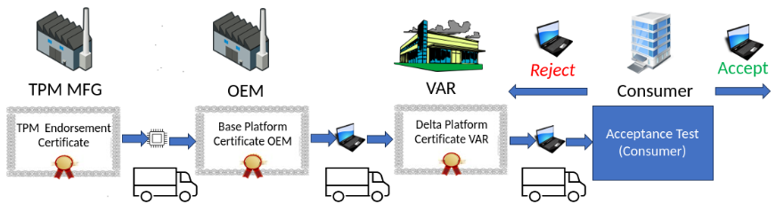
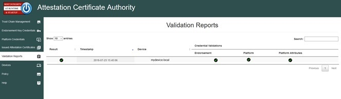

<h1><center>Host Integrity at Runtime and Start-up (HIRS) <BR\></center></h1>


<h2>Attestation Certificate Authority (ACA) and TPM Provisioning with Trusted Computing-based Supply Chain Validation </h2>

The Host Integrity at Runtime and Start-up Attestation Certificate Authority is a Proof of Concept - Prototype intended to spur interest and adoption of the [Trusted Platform Module (TPM)](https://trustedcomputinggroup.org/work-groups/trusted-platform-module/). It's intended for testing and development purposes only and is not intended for production. The ACA's functionality supports the provisioning of [TPM 2.0](https://trustedcomputinggroup.org/wp-content/uploads/2019_TCG_TPM2_BriefOverview_DR02web.pdf) with an [Attestation Certificate](https://www.trustedcomputinggroup.org/wp-content/uploads/IWG-Credential_Profiles_V1_R1_14.pdf). The ACA can be configured to enforce the Validation of Endorsement and Platform Credentials to illustrate a supply chain validation capability.

<p align="center">
  
</p>

The HIRS ACA can be used to perform the Acceptance Test. The HIRS ACA is a web based server which processes Attestation Identity Requests.
The ACA provides a “provisioner” application to be installed on all devices which will be requesting Attestation Certificates.

**Notice:** Github Discussions have been enabled for this repo. Please refer to the Discussion entitled "[HIRS development changes](https://github.com/nsacyber/HIRS/discussions/498)" for development and support notifications.
 
## Features

### Attestation Certificate Authority (ACA)
<p align="center">
  
</p>

  * Issues Attestation Certificates or TPM based [Local Device ID (LDevID) certificates](https://github.com/nsacyber/HIRS/wiki/DevID-Certificates) to validated devices holding a TPM
  * Configures policies for enabling/disabling validation procedures
  * Performs TCG-based Supply Chain Validation of connecting clients
      * Optionally validates Endorsement, Platform Certificates, and Reference Integrity Manifests
  * Endorsement Certificate Certificate Chain Validation
      * Process EK Certificates per [TCG EK Credential Profile For TPM Family 2.0](https://trustedcomputinggroup.org/resource/tcg-ek-credential-profile-for-tpm-family-2-0/)
     * Verifies the endorsement key used by the TPM was placed there by the original equipment manufacturer (OEM)
     * Platform Certificate - Certificate Chain Validation
     * Process Platform Certificates per [TCG Platform Attribute Credential Profile Specification Version 1.1 Revision 15](https://trustedcomputinggroup.org/wp-content/uploads/IWG_Platform_Certificate_Profile_v1p1_r15_pubrev.pdf)
        * Updates for the [Platform Certificate Version 2.0](https://trustedcomputinggroup.org/wp-content/uploads/TCG-Platform-Certificate-Profile-Version-2.0-Revision-39.pdf) are in the current development cycle 
    * Verifies the provenance of the system's hardware components, such as the motherboard and chassis, by comparing measured component information against the manufacturers, models, and serial numbers listed in the Platform Certificate
 * Firmware Integrity Validation
    * Uploads and processes [TCG PC Client Reference Integrity Manifests](https://trustedcomputinggroup.org/resource/tcg-pc-client-reference-integrity-manifest-specification/) (RIM)s
    * Creates and verifies a nonce for the TPM Quote
    * Process TMP Event Logs and checks digests against the TPM Quote
    * Verifies individual event digests against the OEM provided Reference Integrity Measurements
    * Checks that firmware and boot related file hashes match those provided by OEMs.
    * Validates the import of All RIM files imported to the ACA (insure all RIM files were signed by trusted sources)
    * Verifies that the firmware hashes captured by the TPMs Platform Configuration Registers (PCRs) match the firmware hashes obtained from the OEM(s).
    * Verifies TCG/UEFI boot variables (e.g. BIOS setup data) have not been altered (e.g secure boot).
 * Attestation CA Dashboard
    * Displays all Validation Reports, Certificates, and Trust Chains
    * Enables ACA policy configuration for validation of Endorsement and Platform Certificates
    * Enables Import/Export of Certificate (Trust) Chains, Endorsement Certificates, and Platform Certificates
    * Optionally allows uploaded Certificates of trusted parties

### [TPM Provisioner](https://github.com/nsacyber/HIRS/tree/main/HIRS_Provisioner.NET)
  * Requests an Attestation Certificate for the TPM from the ACA.
  * Transfer's TCG Artifacts to the ACA (TPM Endorsement Certificates, Platform Certificates, Reference Integrity Manifests, Event Logs, etc.) 
  * Reads the device's hardware, network, firmware, and OS info for platform and component validation
  * Provides a TPM Quote for Firmware Integrity Checking

### [TCG RIM Tool](https://github.com/nsacyber/HIRS/tree/main/tools/tcg_rim_tool)
  * Creates , Formats, and Digitally Signs [TCG PC Client Base RIMs](https://trustedcomputinggroup.org/resource/tcg-pc-client-reference-integrity-manifest-specification/)
  * Validates the signature of TCG PC CLient Base RIMs
  
### [TCG Event Log Tool](https://github.com/nsacyber/HIRS/tree/main/tools/tcg_eventlog_tool)
  * Parses binary TPM Event Logs and displays event data in a human readable form
  * Extracts Events from TPM Event Logs for test pattern generation
  * Provides Expected PCR values from a complete TPM Event Log

### [Platform Certificate Creator - PACCOR](https://github.com/nsacyber/paccor/)
  * Creates platform certificates according to the [TCG Platform Certificate Profile](https://trustedcomputinggroup.org/resource/tcg-platform-certificate-profile/).
     * Assists in gathering all of the data that can go into a PC and produce a signed attribute certificate
  * Validates signatures on TCG Platform Certificates
     
## Installation Instructions

For detailed instructions, see [Installation notes](https://github.com/nsacyber/HIRS/wiki/installation_notes).

Packages used for installation can be found on the [release page](https://github.com/nsacyber/HIRS/releases). 
 
### Installing the HIRS ACA
There are several options for installing the HIRS ACA

An ACA Docker image is automatically created for each release. To run the ACA container using docker

``` 
docker run --name=aca -p 8443:8443 ghcr.io/nsacyber/hirs/aca:latest
```
To install the ACA on a Redhat or Rocky Linux download the latest rpm from the [release page](https://github.com/nsacyber/HIRS/releases)
then run the command 

```
sudo dnf install HIRS_AttestationCA*.rpm.
```

To install the ACA on a Ubuntu Linux download the latest rpm from the [release page](https://github.com/nsacyber/HIRS/releases)
then run the command 

```
sudo apt-get install HIRS_AttestationCA*.deb.
```

### Installing the HIRS_Provisioner.NET

To install the HIRS_Provisioner.NET on a Redhat or Rocky Linux download the latest rpm package from the [release page](https://github.com/nsacyber/HIRS/releases) then open a terminal and run the command 

```
sudo dnf install HIRS_Provisioner.NET.*.rpm
```

To install the HIRS_Provisioner.NET on Ubuntu Linux download the latest deb package from the [release page](https://github.com/nsacyber/HIRS/releases) then open a terminal and run the command

```
sudo apt-get install HIRS_Provisioner.NET.*.deb
```

To install the HIRS_Provisioner.NET on Windows download the latest msi package from the [release page](https://github.com/nsacyber/HIRS/releases) then open a powershell windows as an administrator then run the command

```
msiexec /package HIRS_Provisioner.NET.*.msi /quiet
```

Then follow the instructions for setting up the HIRS_provisioner.NET in the [HIRS_Provisioner.NET Readme](https://github.com/nsacyber/HIRS/blob/master/HIRS_AttestationCAPortal/src/main/webapp/docs/HIRS%20.NET%20Provisioner%20Readme_2.2.pdf).

## Usage

On Linux: To kick off a procompletelyvision on the client, open a  terminal and run the command 

```
sudo tpm_aca_provision
```

On Windows: Open a powershell terminal as an administrator and enter the command 

```
tpm_aca_provision
```

To see the results and interact with the ACA, using a browser go to the ACA Portal usng the URL:
 
```
https://localhost:8443/
```

For more information see the [Getting Started Guide](https://github.com/nsacyber/HIRS/wiki/Gettingstarted)

## Development History

Version 1.1 added support for the [Platform Certificate v1.1 Specification](https://trustedcomputinggroup.org/resource/tcg-platform-certificate-profile/). This allows entities that are part of the supply chain (System integrators and Value Added Resellers) the ability to create Delta Platform Certificate to compliment the Base Platform Certificate created by the Platform Manufacturer. See the [Article on Base and Delta Platform Certificates](https://github.com/nsacyber/HIRS/wiki/Base-and-Delta-Platform-Certificates) for details.

Version 2.0 added support for the [PC Client Reference Integrity Manifest (RIM) Specification](https://trustedcomputinggroup.org/resource/tcg-pc-client-reference-integrity-manifest-specification/) to provide firmware validation capability to the HIRS ACA. This requires that the manufacturer of a device provide a digitally signed RIM "Bundle" for each device. The HIRS ACA has a new page for uploading and viewing RIM Bundles and a policy setting for requiring Firmware validation.

Version 3.0 was completely refactored to build and run on multiple platforms. The Base OS used for development of the ACA was migrated to Rocky Linux with updates to current dependencies (e.g. Java, Tomcat, Mariadb, etc.) and development tools (e.g. Gradle). New features introduced in Version 3.0 include support for the PC Client RIM 1.1 specification including composite RIMs, time-stamps, and counter signatures and detailed linkages between TCG Event Logs, OEM issuer certificates, and Reference Integrity Manifests (RIMs) have been added to provide greater granularity of information. Support for TPM 1.2 (HIRS_Provisioner) and the Cplus version of the TPM provsioner (HIRS_ProvisionerTPM2) was dropped from Version 3.0 and replaced with the [HIRS_Provisioner.NET](https://github.com/nsacyber/HIRS/tree/master/HIRS_Provisioner.NET).

To support the TCG RIM concept a new [tools folder](https://github.com/nsacyber/HIRS/tree/master/tools) has been added to the HIRS project which contains a [tcg_rim_tool command line application](https://github.com/nsacyber/HIRS/tree/master/tools/tcg_rim_tool). The tcg_rim_tool can be used to create NISTIR 8060 compatible SWID tags that adhere to the TCG PC Client RIM specification. It also supports the ability to digitally sign the Base RIM file as the HIRS ACA will require a valid signature in order to upload any RIM file. See the [tgc_rim_tool READ.md](https://github.com/nsacyber/HIRS/blob/master/tools/tcg_rim_tool/README.md) for more details.

## Quick Links:
Background
* [TPM 2.0: A brief introduction](https://trustedcomputinggroup.org/wp-content/uploads/2019_TCG_TPM2_BriefOverview_DR02web.pdf)
* [Getting started with the ACA and Platform Certificates](https://github.com/nsacyber/HIRS/wiki/Gettingstarted)

HIRS Documentation
* [HIRS ACA and TPM provisioner Users Guide](https://github.com/nsacyber/HIRS/blob/master/HIRS_AttestationCAPortal/src/main/webapp/docs/HIRS_ACA_UsersGuide_2.1.pdf)
* [HIRS_Provisioner.NET Readme](https://github.com/nsacyber/HIRS/blob/master/HIRS_AttestationCAPortal/src/main/webapp/docs/HIRS%20.NET%20Provisioner%20Readme_2.2.pdf)
* [TCG RIM Tool Users Guide](https://github.com/nsacyber/HIRS/blob/master/HIRS_AttestationCAPortal/src/main/webapp/docs/TCG%20Rim%20Tool%20User%20Guide%202.1.pdf)
* [TCG Event Log Tool Users Guide](https://github.com/nsacyber/HIRS/blob/master/HIRS_AttestationCAPortal/src/main/webapp/docs/TCG%20Event%20Log%20Tool%20User%20Guide%202.1.pdf)

HIRS Notes
* [Installation notes](https://github.com/nsacyber/HIRS/wiki/installation_notes)
* [Project build instructions](https://github.com/nsacyber/HIRS/wiki/Hirs-build-guide)
* [HIRS Attestation Certificate Authority FAQ](https://github.com/nsacyber/HIRS/wiki/FAQ)
* [TPM Provisioner Debug](https://github.com/nsacyber/HIRS/wiki/provisioner_debug)
* [ACA Debug](https://github.com/nsacyber/HIRS/wiki/aca_debug)

Tools
  * [Platform Certificate Creator](https://github.com/nsacyber/paccor) 
  * [Reference Integrity Manifest tool (tcg_rim_tool)](https://github.com/nsacyber/HIRS/releases)
  * [Event Log tool (tcg_eventlog_tool)](https://github.com/nsacyber/HIRS/releases)
