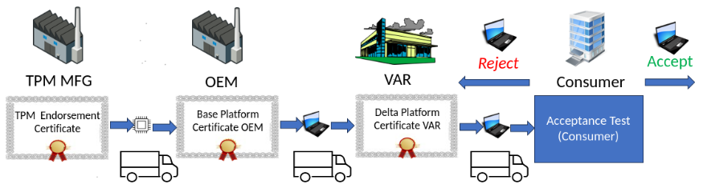
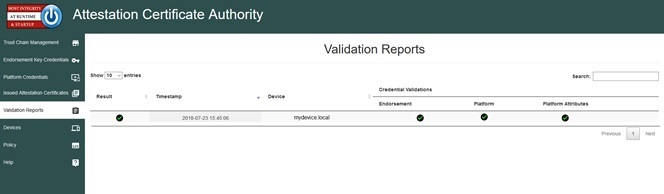

<h1>Host Integrity at Runtime and Start-up (HIRS) <br></h1>

| HIRS System Tests | HIRS ACA Tests | HIRS Provisioner Tests| Information                                                                                       | 
| ------ | ------ | ------ |---------------------------------------------------------------------------------------------------|
| [](https://github.com/nsacyber/HIRS/actions/workflows/system_test.yml)  | [](https://github.com/nsacyber/HIRS/actions/workflows/hirs_unit_tests.yml)|[](https://github.com/nsacyber/HIRS/actions/workflows/dotnet_provisioner_unit_tests.yml)| [{width=100 height=75}](http://localhost:8000/HIRS/HIRS/) |


<h2>Attestation Certificate Authority (ACA) and TPM Provisioning with Trusted Computing-based Supply Chain Validation </h2>

Host Integrity at Runtime and Start-up (HIRS) is a Proof of Concept - Prototype intended to spur interest and adoption of [Trusted Computing](https://trustedcomputinggroup.org) based concepts. It's intended for testing and development purposes only and is not intended for production.

HIRS is composed of an Attestation Certificate Authority (ACA) web based application and a corresponding, client-side, Provisioner application. The ACA can be configured to validate the platform's configuration and firmware against a set of OEM provided artifacts. This illustrates a supply chain validation capability known as an Acceptance Test discussed in the  [Procurement and Acceptance Testing Guide](https://media.defense.gov/2023/Sep/28/2003310132/-1/-1/0/CSI_PROCUREMENT_ACCEPTANCE_TESTING_GUIDE.PDF) for organizations procuring enterprise servers, desktops, and laptops.

{width=880 height=230}

**Notice:** Github Discussions have been enabled for this repo. Please refer to the [HIRS Discussions](https://github.com/nsacyber/HIRS/discussions) for development and support notifications.

## Features

The HIRS ACA is a web based server which processes Attestation Identity Requests.
The ACA provides a “provisioner” application to be installed on all devices which will be requesting Attestation Certificates.

### Attestation Certificate Authority (ACA)
{width=664 height=194}
{width=880 height=230}

* [Issues Attestation Certificates](http://localhost:8000/HIRS/HIRS/userguide/portal/portal-issued-certs/) or TPM
  based [Local Device ID (LDevID) certificates](http://localhost:8000/HIRS/HIRS/userguide/portal/portal-issued-certs/) to validated devices
  holding a TPM
* [Configures policies](http://localhost:8000/HIRS/HIRS/userguide/portal/portal-policy/) for enabling/disabling validation procedures
* Performs [TCG-based Supply Chain Validation](http://localhost:8000/HIRS/HIRS/userguide/portal/portal-validation-reports/) of connecting clients
    * Optionally validates Endorsement, Platform Certificates, and Reference Integrity Manifests
* Endorsement Certificate Certificate Chain Validation
    * [Process EK Certificates](localhost:8000/HIRS/HIRS/userguide/portal/portal-endorsement-certs/)
      per [TCG EK Credential Profile For TPM Family 2.0](https://trustedcomputinggroup.org/resource/tcg-ek-credential-profile-for-tpm-family-2-0/)
    * Verifies the endorsement key used by the TPM was placed there by the original equipment manufacturer (OEM)
    * Platform Certificate - Certificate Chain Validation
    * Process [Platform Certificates](http://localhost:8000/HIRS/HIRS/userguide/portal/portal-platform-certs/)
      per [TCG Platform Attribute Credential Profile Specification Version 1.1 Revision 15](https://trustedcomputinggroup.org/wp-content/uploads/IWG_Platform_Certificate_Profile_v1p1_r15_pubrev.pdf)
        * Updates for
          the [Platform Certificate Version 2.0](https://trustedcomputinggroup.org/wp-content/uploads/TCG-Platform-Certificate-Profile-Version-2.0-Revision-39.pdf)
          are in the current development cycle
    * Verifies the provenance of the system's hardware components, such as the motherboard and chassis, by comparing measured
      component information against the manufacturers, models, and serial numbers listed in the Platform Certificate
* Firmware Integrity Validation
    * Uploads and
      processes [TCG PC Client Reference Integrity Manifests](http://localhost:8000/HIRS/HIRS/userguide/portal/portal-rims/) (RIM)s
    * Creates and verifies a nonce for the TPM Quote
    * Process TMP Event Logs and checks digests against the TPM Quote
    * Verifies individual event digests against the [OEM provided Reference Integrity Measurements](http://localhost:8000/HIRS/HIRS/userguide/portal/portal-rims/)
    * Checks that firmware and boot related file hashes match those provided by OEMs.
    * Validates the import of All RIM files imported to the ACA (insure all RIM files were signed by trusted sources)
    * Verifies that the firmware hashes captured by the TPMs Platform Configuration Registers (PCRs) match the firmware hashes
      obtained from the OEM(s).
    * Verifies TCG/UEFI boot variables (e.g. BIOS setup data) have not been altered (e.g secure boot).
* Attestation CA Dashboard
    * Displays all Validation Reports, Certificates, and Trust Chains
    * Enables ACA policy configuration for validation of Endorsement and Platform Certificates
    * Enables Import/Export of [Certificate (Trust) Chains](http://localhost:8000/HIRS/HIRS/userguide/portal/portal-trust-chain/), Endorsement Certificates, and Platform Certificates
    * Optionally allows uploaded Certificates of trusted parties

### [TPM Provisioner](https://github.com/nsacyber/HIRS/tree/main/HIRS_Provisioner.NET)

* Requests an Attestation Certificate for the TPM from the ACA.
* Transfer's TCG Artifacts to the ACA (TPM Endorsement Certificates, Platform Certificates, Reference Integrity Manifests, Event
  Logs, etc.)
* Reads the device's hardware, network, firmware, and OS info for platform and component validation
* Provides a TPM Quote for Firmware Integrity Checking
* For more information see the [TPM Provisioner help page](localhost:8000/HIRS/HIRS/hirs-provisioner/)

### [RIM Tool](https://github.com/nsacyber/RIM-Tool)

* Creates , Formats, and Digitally
  Signs [TCG PC Client Base RIMs](https://trustedcomputinggroup.org/resource/tcg-pc-client-reference-integrity-manifest-specification/), TCG Component RIMs (both SWID and CoSWID variants), as well as IETF CoRIMs.
* Validates the signature of TCG PC Client Base RIMs, IETF CoSwids, IETF CoRims, and TCG Component RIMs.
* For more information see the [RIM Tool Github repository](https://github.com/nsacyber/RIM-Tool).

### [TCG Event Log Tool](https://github.com/nsacyber/HIRS/tree/main/tools/tcg_eventlog_tool)

* Parses binary TPM Event Logs and displays event data in a human readable form
* Extracts Events from TPM Event Logs for test pattern generation
* Provides Expected PCR values from a complete TPM Event Log
* For more information see the [TCG Event Log Tool help page](http://localhost:8000/HIRS/HIRS/userguide/tools/eventlogtool/)

### [Platform Certificate Creator - PACCOR](https://github.com/nsacyber/paccor/)

* Creates platform certificates according to
  the [TCG Platform Certificate Profile](https://trustedcomputinggroup.org/resource/tcg-platform-certificate-profile/).
    * Assists in gathering all of the data that can go into a PC and produce a signed attribute certificate
* Validates signatures on TCG Platform Certificates
* For more information see the [PACCOR github repository](https://github.com/nsacyber/paccor/)

## Installation Instructions

NOTE: The HIRS ACA, tcg_rim_tool, and tcg_eventLog_tool require Java 25 jre be installed before attempting to install these
packages.
For detailed instructions, see [Installation notes](http://localhost:8000/HIRS/HIRS/install/).

Packages used for installation can be found on the [release page](https://github.com/nsacyber/HIRS/releases).

### Installing the HIRS ACA

There are several options for installing the HIRS ACA

An ACA Docker image is automatically created for each release. To run the ACA container using docker

``` 
docker run --name=aca -p 8443:8443 ghcr.io/nsacyber/hirs/aca:latest
```

To install the ACA on a Redhat or Rocky Linux download the latest rpm from
the [release page](https://github.com/nsacyber/HIRS/releases)
then run the command

```
sudo dnf install HIRS_AttestationCA*.rpm.
```

To install the ACA on a Ubuntu Linux download the latest rpm from the [release page](https://github.com/nsacyber/HIRS/releases)
then run the command

```
sudo apt-get install ./HIRS_AttestationCA*.deb.
```
For more information see the [HIRS install help page](http://localhost:8000/HIRS/HIRS/install/)

### Installing the HIRS_Provisioner.NET

To install the HIRS_Provisioner.NET on a Redhat or Rocky Linux download the latest rpm package from
the [release page](https://github.com/nsacyber/HIRS/releases) then open a terminal and run the command

```
sudo dnf install HIRS_Provisioner.NET.*.rpm
```

To install the HIRS_Provisioner.NET on Ubuntu Linux download the latest deb package from
the [release page](https://github.com/nsacyber/HIRS/releases) then open a terminal and run the command

```
sudo apt-get install ./HIRS_Provisioner.NET.*.deb
```

To install the HIRS_Provisioner.NET on Windows download the latest msi package from
the [release page](https://github.com/nsacyber/HIRS/releases) then open a powershell windows as an administrator then run the
command

```
msiexec /package HIRS_Provisioner.NET.*.msi /quiet
```

Then follow the instructions for setting up the HIRS_provisioner.NET in
the [HIRS_Provisioner.NET User Guide](http://localhost:8000/HIRS/HIRS/hirs-provisioner/).

## Usage

On Linux: To kick off a provision on the client, open a terminal and run the command

```
sudo tpm_aca_provision
```

On Windows: Open a powershell terminal as an administrator and enter the command

```
tpm_aca_provision
```

To see the results and interact with the ACA, using a browser go to the ACA Portal usng the URL:

```
https://localhost:8443/
```

For more information see the [Getting Started Guide](http://localhost:8000/HIRS/HIRS/userguide/)


## Quick Links:

Background

* [TPM 2.0: A brief introduction](https://trustedcomputinggroup.org/wp-content/uploads/2019_TCG_TPM2_BriefOverview_DR02web.pdf)
* [Getting started with the ACA and Platform Certificates](http://localhost:8000/HIRS/HIRS/userguide/)

HIRS Documentation

* [HIRS ACA and TPM provisioner Users Guide](http:/localhost:8000/HIRS/HIRS/)
* [HIRS_Provisioner.NET Users Guide](http://localhost:8000/HIRS/HIRS/hirs-provisioner/)
* [RIM-Tool](https://github.com/nsacyber/RIM-Tool) and [RIM Tool Users Guide](https://nsacyber.github.io/RIM-Tool/)
* [TCG Event Log Tool Users Guide](https://github.com/nsacyber/HIRS/blob/main/docs/TCG_Event_Log_Tool_User_Guide_3.0.pdf)

HIRS Notes

* [Installation notes](http://localhost:8000/HIRS/HIRS/install/)
* [Project build instructions](http://localhost:8000/HIRS/HIRS/install/)
* [HIRS Attestation Certificate Authority FAQ](https://github.com/nsacyber/HIRS/wiki/FAQ)
* [TPM Provisioner Debug](https://github.com/nsacyber/HIRS/wiki/provisioner_debug)
* [ACA Debug](https://github.com/nsacyber/HIRS/wiki/aca_debug)

Tools

* [Platform Certificate Creator](https://github.com/nsacyber/paccor)
* [Reference Integrity Manifest tool (RIM-Tool)](https://github.com/nsacyber/RIM-Tool) and [RIM Tool Users Guide](https://nsacyber.github.io/RIM-Tool/)
* [Event Log tool (tcg_eventlog_tool)](https://github.com/nsacyber/HIRS/tree/main/tools/tcg_eventlog_tool)