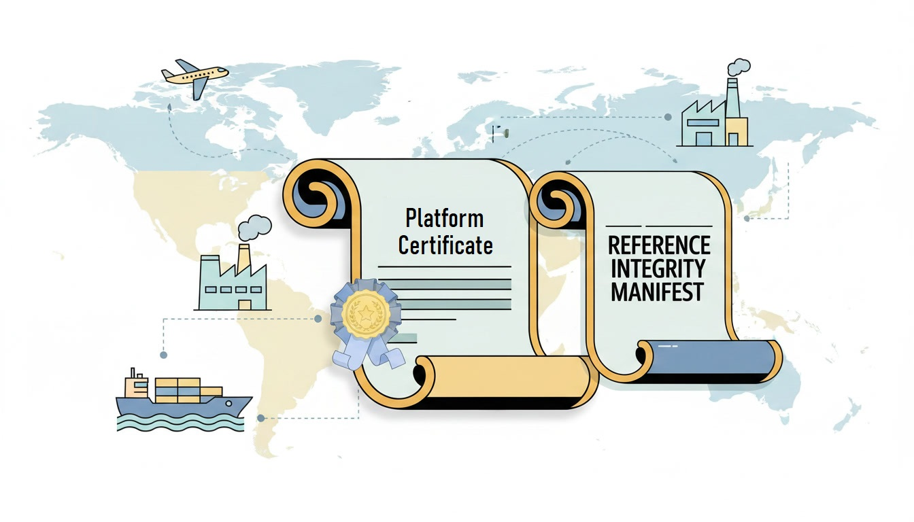

# Behind the Scenes of Supply Chain Validation with HIRS

For any computing device procurement system, understanding and tracing the supply chain is vital
to ensure system integrity and security. Devices and their components pass through multiple vendors and
manufacturers which creates opportunities for counterfeit hardware, unauthorized modifications, or
compromised firmware to enter the system.

Verifiers like HIRS provide a practical and reliable solution by cryptographically verifying devices
and components using digitally signed artifacts. These artifacts trace the origin and integrity of each
element, establishing a verifiable chain of trust from manufacturing to deployment.

By performing this verification, organizations can detect counterfeit devices, unauthorized hardware or
firmware changes, and verify critical security properties embedded in the platform. This capability is
essential not only for regulatory compliance but also for protecting sensitive data, maintaining
operational reliability, and mitigating supply chain risks in modern IT environments.

