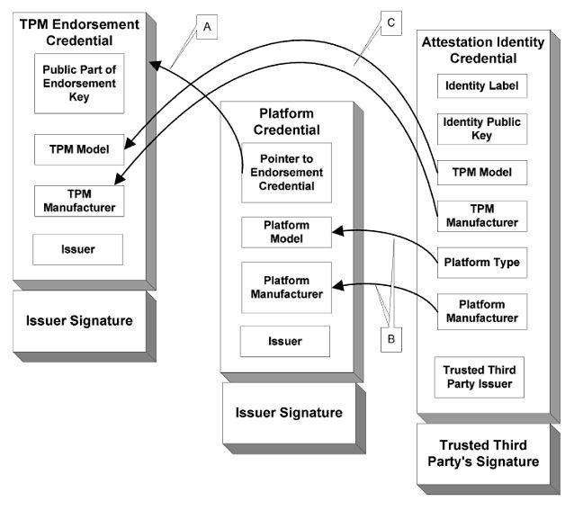

# Validation Inputs

Validators such as HIRS require certain artifacts in order to process validation.

The [Trusted Computing Group :fontawesome-solid-external-link:](https://trustedcomputinggroup.org){:target="_blank"}
(TCG) defines artifacts used to provision the TPM and perform supply chain validation processes.
These artifacts provide the Expected Values (Assertions) of software configurations and 
supply chain entities associated with the manufacturing, assembly, and delivery of the device.

These artifacts include:

| Artifact Input                                  | Creator                                          | Usage                                                                                                                                 |
|-------------------------------------------------|--------------------------------------------------|---------------------------------------------------------------------------------------------------------------------------------------|
| [**EK Credential**](endorsement-cert.md)        | :factory: TPM Manufacturer                       | Validates that the TPM was manufactured by the TPM vendor and meets the TPM vendor's documented features                              |
| [**Platform Certificate**](platform-cert.md)    | :computer: Motherboard Manufacturer              | Validates that the platform was manufactured by the specified vendor and meets their documented features                              |
| [**Reference Integrity Manifest**](rim.md)      | :scroll: Manufacturers, VARs, System Integrators | - If `XML`: Validates PC firmware - If `CBOR`: Validates platform components (hardware and firmware)     |

The EK Credential and Platform Certificate are X.509 Certificates. The Platform Certificate 
is an Attribute Certificate that ties back to one of the public key based EK Credentials 
using its certificate attributes:

The EK Credential and the Attestation Certificate ("Attestation Identity Credential" 
in the image) each have a private key within the TPM 
that can be used to validate their corresponding certificates. The Platform Certificate is tied to the
EK Credential via its attributes and has no private key of its own. It cannot be considered
valid unless the EK Credential is first verified.
