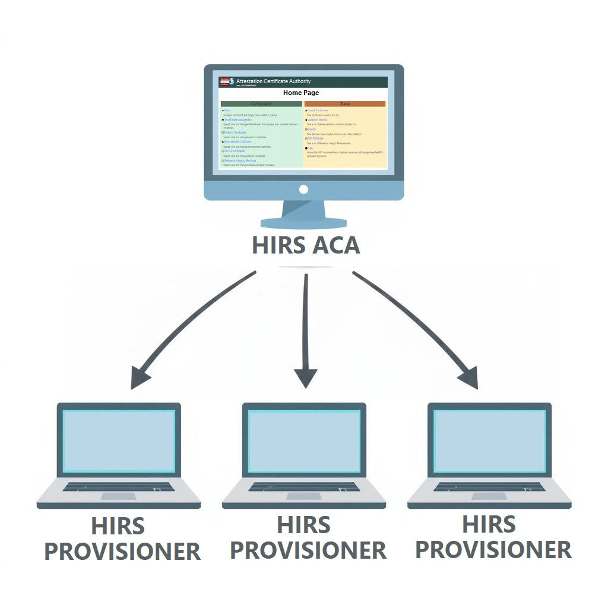

The [HIRS ACA](hirs-aca.md) (Attestation Certificate Authority) is a web-based application 
which processes requests from one or more [HIRS Provisioner](hirs-provisioner.md) applications. 
Together, the HIRS ACA and HIRS Provisioner comprise the complete validation service HIRS.
 
 

 
Quick Links:

* [Getting Started](started/index.md)
* [ACA Installation](install/aca-install.md)
* [Provisioner Installation](install/prov-install.md)
* [Validation Run](install/validation-run.md)
* [Artifacts](started/gs4-artifacts.md)
* [ACA Portal Guide](webportal/index.md)
* [Tools](tools/index.md)
* [Downloads](install/downloads.md)
 
 
 
 
 

HIRS is compatible with Platform Certificates created by the 
[Platform Attribute Certificate Creator :fontawesome-solid-external-link:](https://github.com/nsacyber/paccor){:target="_blank"}
(PACCOR) and RIM Bundles created by the 
[Rim-Tool :fontawesome-solid-external-link:](https://github.com/nsacyber/RIM-Tool){:target="_blank"}. 

HIRS is based upon the Trusted Computing concepts defined by the 
[Trusted Computing Group :fontawesome-solid-external-link:](https://trustedcomputinggroup.org){:target="_blank"}
(TCG), and supports an attestation certificate authority policy that is recommended for 
Trusted Computing based supply chain validation. 

!!! info

    The project can be found on [GitHub :fontawesome-solid-external-link:](https://github.com/nsacyber/HIRS){:target="_blank"}.
